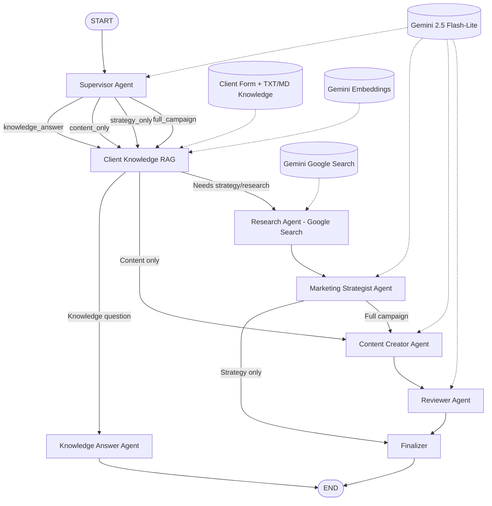

# MarketingFlow AI — LangGraph Flow



## Full campaign path

```text
Client Form / Documents
        ↓
Supervisor
        ↓
Client Knowledge Agent (Semantic RAG)
        ↓
Research Agent (Live Google Search)
        ↓
Marketing Strategist
        ↓
Content Creator
        ↓
Reviewer
        ↓
Final Deliverable
```
